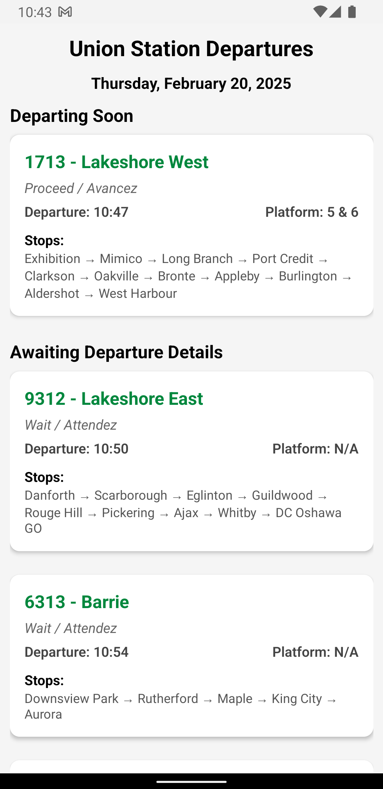

# GO Train Tracker iOS

A modern iOS application that displays real-time GO Train information, built with React Native and TypeScript. This is the iOS sister app of the GO Train Tracker Android application.

## Current Implementation

### Features Implemented

* View all upcoming departures from Union Station
* Real-time departure information including:
  * Train number and service
  * Departure time
  * Platform number
  * Trip status/information
  * Stops along the route
* Clean, modern UI with easy-to-read cards for each departure

### Technical Implementation

#### Architecture

The app follows clean architecture principles with a component-based architecture:

* **Components**
  * Reusable UI components like `DepartureCard`
  * Screen components like `UnionStationDeparturesScreen`
* **TypeScript** for type safety
* **React Native** for cross-platform development

## Setup

1. Clone the repository
2. Install dependencies with `yarn`
3. Create a `.env` file with your GO Train API key:

   ```
   GO_TRAIN_API_KEY=your_api_key_here
   ```

4. Run the app using `yarn android` or `yarn ios`

## Screenshots



## Contributing

Feel free to submit issues and pull requests.

## License

MIT License

Copyright (c) 2024

Permission is hereby granted, free of charge, to any person obtaining a copy
of this software and associated documentation files (the "Software"), to deal
in the Software, including without limitation the rights to use, copy, modify,
merge, publish, distribute, and/or sublicense copies of the Software, and to
permit persons to whom the Software is furnished to do so, subject to the
following conditions:

1. The above copyright notice and this permission notice shall be included in all
   copies or substantial portions of the Software.

2. Commercial use, distribution, or publication of the Software or any
   derivative works is prohibited without explicit written permission from
   the copyright holder.

3. The Software is provided for educational and personal use only.

THE SOFTWARE IS PROVIDED "AS IS", WITHOUT WARRANTY OF ANY KIND, EXPRESS OR
IMPLIED, INCLUDING BUT NOT LIMITED TO THE WARRANTIES OF MERCHANTABILITY,
FITNESS FOR A PARTICULAR PURPOSE AND NONINFRINGEMENT. IN NO EVENT SHALL THE
AUTHORS OR COPYRIGHT HOLDERS BE LIABLE FOR ANY CLAIM, DAMAGES OR OTHER
LIABILITY, WHETHER IN AN ACTION OF CONTRACT, TORT OR OTHERWISE, ARISING FROM,
OUT OF OR IN CONNECTION WITH THE SOFTWARE OR THE USE OR OTHER DEALINGS IN THE
SOFTWARE.
